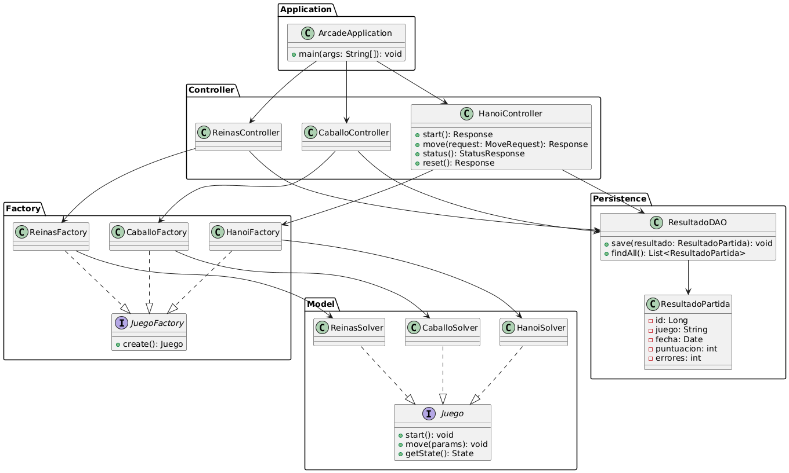
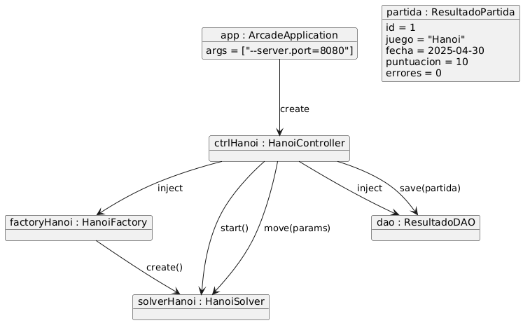
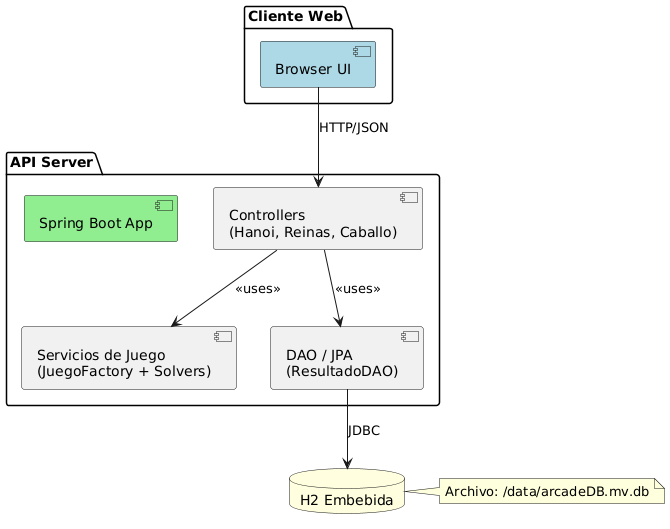

# Maquina-3D-Juegos

  


**Demo en producción:** [https://maquina-3d-juegos.onrender.com](https://maquina-3d-juegos.onrender.com)


## Descripción

**Maquina-3D-Juegos** es una arcade web basada en Spring Boot que implementa tres puzzles clásicos (Torres de Hanoi, N-Reinas y Tour del Caballo). Incluye:

- Lógica de resolución algorítmica (recursión, backtracking, heurística).
- API REST para jugar y consultar resultados.
- Persistencia de scores con Hibernate/H2.
- Interfaz gráfica “retro-arcade” basada en Canvas y fetch.
- Dockerfile para contenedorización.

---

## Índice

## Índice

1. [Características](#características)
2. [Pre-requisitos](#pre-requisitos)
3. [Instalación y arranque](#instalación-y-arranque)
4. [Uso](#uso)
5. [Estructura del proyecto](#estructura-del-proyecto)
6. [Tecnologías y patrones](#tecnologías-y-patrones)
7. [Configuración](#configuración)
8. [Docker](#docker)
9. [Diagramas UML](#diagramas-uml)
    - [Diagrama de clases](#diagrama-de-clases)
    - [Diagrama de objetos](#diagrama-de-objetos)
    - [Diagrama de componentes](#diagrama-de-componentes)
10. [Contribuciones](#contribuciones)
11. [Licencia](#licencia)
12. [Enlace](#enlace)
13. [Dudas](#dudas)


---


## Características

- **Torres de Hanoi** con pasos recursivos y animaciones visuales.
- **N-Reinas** con backtracking y visualización de tableros.
- **Tour del Caballo** usando heurística de Warnsdorff.
- **Persistencia** de partidas con fecha, puntuación y errores.
- **API REST** para iniciar, avanzar y resetear cada juego.
- **Frontend retro** con Canvas 2D y llamadas `fetch`.
- **Docker** para despliegue rápido.

---

## Pre-requisitos

- **Java 17 JDK**
- **Maven 3.6+**
- **Docker** (opcional, para contenedor)

---


## Instalación y arranque

1. Clonar el repositorio:
   ```bash
   git clone https://github.com/tu-usuario/Maquina-3D-Juegos.git
   cd Maquina-3D-Juegos
    ```
2. Compilar el proyecto:
   ```bash
   mvn clean install
   ```
3. Ejecutar la aplicación:
   ```bash
    java -jar target/maquina-3d-juegos-0.0.1.jar    
   ```
4. Acceder a la aplicación en el navegador:
   ```
    http://localhost:8080
    ```


## Uso

1. Abre tu navegador y navega a `http://localhost:8080/` para ver la página principal con los tres juegos disponibles.
2. Selecciona un juego (Hanoi, Reinas o Caballo) para cargar la interfaz Canvas correspondiente.
3. La UI “retro-arcade” mostrará controles para:
    - **Iniciar partida**: envía `POST /api/{juego}/start`
    - **Avanzar un paso**: envía `POST /api/{juego}/move` con un payload JSON específico al juego
    - **Resetear partida**: envía `POST /api/{juego}/reset`
    - **Consultar estado**: `GET /api/{juego}/status` devuelve el tablero actual, puntuación y número de errores
4. Todos los movimientos y estados se persisten automáticamente en la base de datos H2 (archivo `./data/arcadeDB.mv.db`).
5. Para interaccionar manualmente vía cURL o Postman, utiliza la URL base:


## Estructura del proyecto

```plaintext
Maquina-3D-Juegos/
├── Dockerfile
├── pom.xml
├── README.md
├── frontend/
│   └── index.html          # Artefactos generados por Vaadin
├── src/
│   └── main/
│       ├── java/
│       │   └── com/
│       │       └── maquina3djuegos/
│       │           ├── ArcadeApplication.java  # Punto de arranque Spring Boot
│       │           ├── adapter/                 # Patrón Adapter → visualización
│       │           ├── controller/              # Controladores REST
│       │           ├── decorator/               # Patrón Decorator → logging
│       │           ├── factory/                 # Patrón Factory → creación de juegos
│       │           ├── model/                   # Lógica de puzzles (solvers)
│       │           └── persistence/             # DAO + entidades Hibernate
│       └── resources/
│           ├── application.properties          # Configuración Spring Boot
│           └── static/                         # Frontend estático (HTML/CSS/JS)
├── data/                                      # Base de datos H2 embebida
└── .gitignore
```


## Tecnologías y patrones

- **Java 17**, **Spring Boot 3.1.3**
- **Hibernate ORM 5.x** + **H2** para persistencia
- **Maven** (BOM de Vaadin importado)
- **Patrones de diseño**:
    - Factory
    - Adapter
    - Decorator
    - DAO
- **Frontend**: HTML5 Canvas 2D + Vanilla JS (`fetch`)
- **Docker**: contenedor ligero basado en JDK17


## Configuración

Edita `src/main/resources/application.properties`:

```properties
server.port=8080

# Configuración de H2 (archivo local en /data)
spring.datasource.url=jdbc:h2:file:./data/arcadeDB;DB_CLOSE_ON_EXIT=FALSE;AUTO_SERVER=TRUE
spring.datasource.username=sa
spring.datasource.password=
spring.jpa.hibernate.ddl-auto=update


   ```

## Docker

1. Construye la imagen:
   ```bash
   docker build -t maquina-3d-juegos:latest .
    ```
2. Ejecuta el contenedor:
   ```bash
   docker run -d -p 8080:8080 --name maquina-3d-juegos maquina-3d-juegos:latest
    ```
3. Accede a la aplicación en el navegador:
   ```bash
   http://localhost:8080
    ```


## Diagrama de clases





## Diagrama de objetos





## Diagrama de Componentes




## Contribuciones

1. Haz un fork de este repositorio.
2. Crea una rama para tu nueva funcionalidad o corrección de errores:
   ```bash
   git checkout -b feature/nombre-de-tu-rama
    ```
3. Realiza tus cambios y haz commit:
   ```bash
   git commit -m "Descripción de los cambios"
    ```
4. Sube tus cambios:
   ```bash
   git push origin feature/nombre-de-tu-rama
    ```


### Enlace

Enlace al repositorio: https://github.com/YoelUb/Maquina-3D-Juegos


### Dudas

Si tienes dudas sobre la instalación o configuración, no dudes en abrir un issue en el repositorio o contactarme directamente:  yoelurquijo13@gmail.com.
